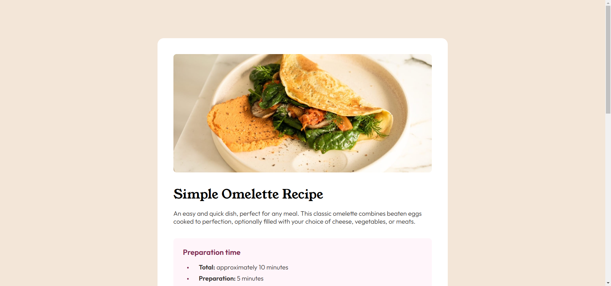
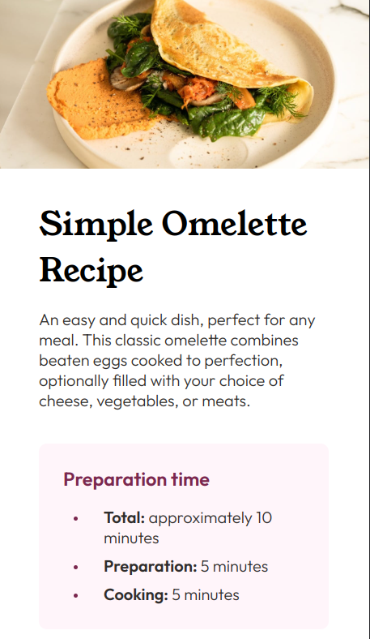

# Frontend Mentor - Recipe page solution

This is a solution to the [Recipe page challenge on Frontend Mentor](https://www.frontendmentor.io/challenges/recipe-page-KiTsR8QQKm). Frontend Mentor challenges help you improve your coding skills by building realistic projects. 

## Table of contents

- [Overview](#overview)
  - [The challenge](#the-challenge)
  - [Screenshot](#screenshot)
  - [Links](#links)
- [My process](#my-process)
  - [Built with](#built-with)
  - [What I learned](#what-i-learned)
  - [Continued development](#continued-development)

## Overview

### Screenshot

### Links

- Solution URL: [Add solution URL here](https://github.com/andrew-j-brown/Recipe-Page-Main)
- Live Site URL: [Add live site URL here](https://andrew-j-brown.github.io/Recipe-Page-Main/)

## My process

### Built with

- HTML5 markup
- CSS custom properties
- Flexbox

### What I learned

This project was quite helpful for both practicing larger html and css files, as well as working with styling elements I am not as used to (such as tables). I also got to work with a (relatively simple) media query, which was fun.

### Continued development

I may development this further into a full recipe site, with page routing. This might be something to return to after picking up ReactJS and a simple backend.